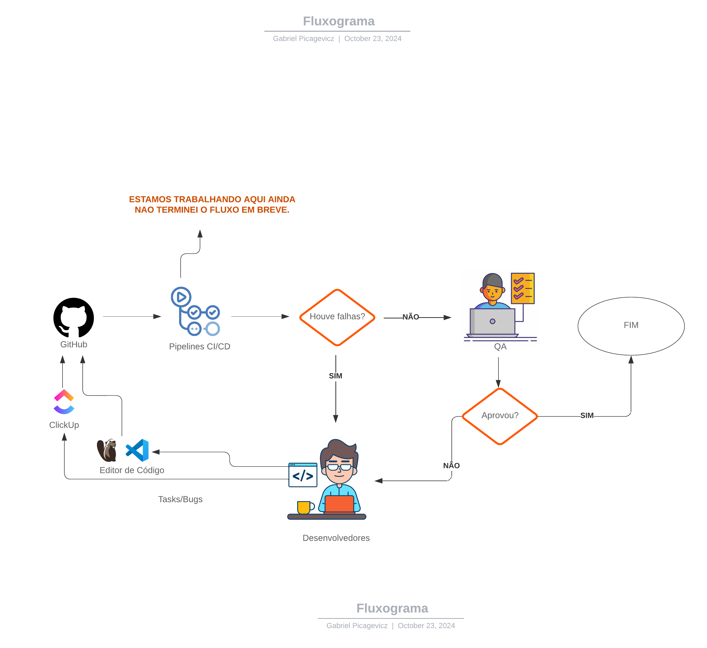

# EasyDots - Testes Automatizados 

Este repositório foi criado para armazenar os testes automatizados de nossos projetos. 
Atualmente, ele contém testes automatizados de nossa API **easy-integracao**.

Além disso, configuramos a execução da Pipeline, que será acionada sempre que os desenvolvedores abrirem um Pull Request (PR). 
No momento, a Pipeline está em funcionamento, mas está configurada para rodar em todos os commits realizados na branch master.

<details>
  <summary><strong>Fluxo de Desenvolvimento - Padrões de testes e Pipelines</strong></summary>

  ### Em breve será construido um texto referente ao nosso fluxo de desenvolvimento e onde e porque repositório irá atuar.

  # spoiler
  
  
</details>

<details>
  <summary><strong>O que são pipelines, por que fazer testes automatizados, e qual a sua importância?</strong></summary>

  ### Em breve
</details>


## Estrutura do Projeto

- `docker-compose.yml`: Define os serviços (k6, InfluxDB, Grafana) e suas configurações.
- `dashboard/`: Contém arquivos de configuração de dashboards do Grafana.
- `k6-load-testing-results_rev3.json`: Pre-configured Grafana dashboard for visualizing k6 results.
- `k6-automacao-api-easy-integracao/`: Contém scripts de testes automatizados, cenários de testes para cada end-point e utilitários..
  - `scripts/`: Será atualizado mais pra frente, entretanto é a pasta onde o docker está olhando para executar.
    - `easy-integracao/`: Contém os scripts dos testes automatizados, cenários de testes para cada end-point e utilitários..
      - `colaborador/`: Contém testes automatizados e documentação para os endpoints relacionados ao colaborador, dentre eles cenários de POST, GET, PUT e DELETE..
        - `colaborador-get.js`: Contém testes automatizados para o endpoint GET do colaborador.
        - `colaborador-post.js`: Contém testes automatizados para o endpoint POST do colaborador.
        - `colaborador-schema.js`: Contém o json-schema do retorno dos end-points para validar se as respostas estão retornando corretamente.
        - `postColaborador.js`: Contém métodos objetos para criação de colaboradores com campos variados, omitindo diferentes propriedades para testes.
   - `utils.js/`: Fornece funções utilitárias para realizar requisições HTTP e validar respostas em testes de carga com k6, facilitando a automação de testes de API.
        - `utils.js/`: Script contendo métodos e funções utilizados globalmente em todos os endpoints de forma frequente.
- `dashboard/`: Contains Grafana configuration files and dashboards.
  - `grafana-datasource.yaml`: Configuração da fonte de dados do InfluxDB para o Grafana.
  - `grafana-dashboard.yaml`: Configuração de dashoboard do painel.
- `run.sh`: Script para iniciar facilmente o teste de carga e os serviços. (AINDA NAO DEU TEMPO DE IMPLEMENTAR TUDO)


Você pode executar o repositório localmente ou via Docker para visualizar as métricas dos testes executados, pois ele sobe uma máquina com o k6 e Grafana, permitindo um melhor acompanhamento dos resultados.

## Como Executar os Testes Local

<details>
  <summary><strong>Executar Localmente - Sem visualização Grafana</strong></summary>

  ### Pré-requisitos

1. **K6**: Certifique-se de que o K6 está instalado na sua máquina.
   - ([Instalar K6](https://dl.k6.io/msi/k6-latest-amd64.msi)) - Importante reiniciar a máquina após a instalação.
  
2. **Node.js**
    ([Instalar Node.js](https://nodejs.org/pt-br))

  Siga os passos abaixo para rodar executar o projeto:

  1. Clone o repositório:
     ```bash
     git clone https://github.com/gabrielpicagevicz/k6-automacao-api-easy-integracao.git
     ```

  2. Instale as dependências necessárias (se houver).

### Escolha como executar os testes

Você tem duas opções para executar os testes:

1. **Executar os testes individualmente**:
   - Se você deseja testar um endpoint específico (por exemplo, o GET do endpoint do colaborador), utilize o seguinte comando:
    - **Exemplo**: Para testar o GET do endpoint do colaborador, o comando seria:
     ```bash
     npm run exec-colaborador-get
     ```

2. **Executar todos os cenários em paralelo**:
   - Para executar todos os testes simultaneamente, utilize o comando abaixo. Este comando executará todos os testes que estão mapeados em `"scripts": {}` no `package.json`:
     ```bash
     npm run exec-paralelo
     ```
</details>


<details>
  <summary><strong>Executar com docker visualização Grafana</strong></summary>

### Pré-requisitos

1. **Docker**: Certifique-se de que o Docker está instalado na sua máquina.
   - [Instalar Docker](https://docs.docker.com/get-docker/)

2. **Docker Compose**: O Docker Compose deve estar instalado.
   - [Instalar Docker Compose](https://docs.docker.com/compose/install/)

### Passos

1. **Clone o repositório**:

   ```bash
   git clone https://github.com/gabrielpicagevicz/k6-automacao-api-easy-integracao.git
   ```
   
   Na sequência, troque acesse a pasta `k6-automacao-api-easy-integracao/` 
    ```bash
   cd .\k6-automacao-api-easy-integracao\ 
   ```

2. **Suba os serviços do InfluxDB e Grafana**:

   Execute o comando abaixo para iniciar os contêineres do InfluxDB e Grafana em segundo plano (background):

   ```bash
   docker-compose up -d influxdb grafana
   ```

3. **Execute os testes com o k6 grafana**:
   - Se você deseja testar um endpoint específico (por exemplo, o POST do endpoint do colaborador), utilize o seguinte comando:

   ```bash
   docker-compose run k6 run /scripts/easy-integracao/colaborador/colaborador-post.js
   ```
```bash
   em breve será possível executar paralelamente
   ```
   
4. **Acesse o Grafana**:

   Após a execução do teste, você pode visualizar os resultados no Grafana:

   - URL do Grafana: [http://localhost:3000/](http://localhost:3000/)

5. **Configure o InfluxDB como fonte de dados no Grafana**:

   Acesse o Grafana, vá até as configurações e adicione o InfluxDB como fonte de dados:

   (Em breve)- URL do InfluxDB: [http://localhost:8888/](http://localhost:8888/)

6. **Visualize o Dashboard**:

    (Em breve) Importe o dashboard localizado na pasta `/dashboards` do projeto para o Grafana e comece a visualizar os resultados do teste.
    
</details>


## -- em breve tbm
<details>
  <summary><strong>Testes de carga no k6, tipos e exemplos: </strong></summary>

Antes de implementar um teste de carga, devemos nos perguntar: o que significa desempenho no contexto de uma API? Isso influencia no tipo de teste que você irá implementar e talvez não precise de todos os cenários.

# Teste de Carga (Load Testing): Avalia como um sistema se comporta sob uma carga esperada. O objetivo é garantir que a aplicação funcione corretamente quando várias solicitações são feitas simultaneamente.

É importante definir o tráfego normal da API e um tempo de resposta aceitável, uma vez que você pode escrever cenários de teste para verificar se a API atende a esses critérios. Por exemplo: posso testar com 10 usuários virtuais e verificar se as respostas estão abaixo de 200 milissegundos, e posso executar esse teste por 5 minutos.
Esse teste lhe dará uma indicação inicial de como sua API se comporta em condições normais.
Exemplo de #Teste de Carga (Load Testing)

import http from 'k6/http';
import { check, sleep } from 'k6';

export const options = {
    vus: 10, // número de usuários virtuais
    duration: '5m', // duração do teste
    thresholds: {
        http_req_duration: ['p(95)<200'], // 95% das requisições devem ter duração abaixo de 200 milissegundos
    },
};

export default function () {
    const response = http.get('https://test.k6.io');; 

    // Verifica se a resposta tem status 200
    check(response, {
        'status é 200': (r) => r.status === 200,
        'duracao das respostas <= 200ms': (r)  => r.timings.duration <= 200,
    });
    sleep(1); // pausa de 1 segundo entre as requisições
}


Em uma aplicação real pode ter momentos em que a aplicação recebe mais solicitações que o normal e você deseja saber como sua API se comportará nesse cenário. 
Você pode subir gradualmente sua API para determinados níveis, e ver como o sistema se comportará, e para isso, você pode usar o conceito de estagios


# Teste de Estresse (Stress Testing): Nesse tipo de teste, você deseja levar a API a um determinado nível para ver o que acontece e  você pode querer aumentar o tempo de resposta esperado ou até mesmo a porcentagem de respostas bem-sucedidas esperadas, porque é apenas assumir que quando sua API está muito sob stress, o desempenho será degradado então o que você deseja avaliar é se o desempenho ainda é aceitável sob essas condições extremas.


import http from "k6/http";
import { check, sleep } from "k6";

export const options = {
  stages: [
    //level 1
    { duration: "1m", target: 100 }, //Aumenta gradualmente o número de VUs para 100 ao longo de 1 minuto.
    { duration: "2m", target: 100 }, // Mantém 100 VUs estáveis por 2 minutos.
    //level 2
    { duration: "1m", target: 200 }, // E então aumenta gradualmente o número de VUs para 200 ao longo de 1 minuto.
    { duration: "2m", target: 200 }, // Mantém 200 VUs estáveis por 2 minutos.
    //level 3
    { duration: "1m", target: 500 }, //E então aumenta gradualmente o número de VUs para 500 ao longo de 1 minuto.
    { duration: "2m", target: 500 }, // Mantém 500 VUs estáveis por 2 minutos.
    // coll down
    { duration: "1m", target: 0 }, //Diminui o número de VUs para 0 ao longo de 1 minuto, permitindo que o sistema volte a um estado normal após o teste.
  ],
  thresholds: {
    http_req_duration: ["p(95)<200"], // 95% das requisições devem ser abaixo de 200 ms
  },
};

export default function () {
  const response = http.get("https://test.k6.io/"); // substitua pela URL da sua API

  // Verifica se a resposta tem status 200
  check(response, {
    "status é 200": (r) => r.status === 200,
  });
}

# Spike Testing (Teste de Pico): Vamos imaginar que você está construindo uma API para uma plataforma de venda de ingresso para shows, então quando há um evento muito popular você geralmente recebe volumes extremamente altos de solicitações durante um curto período de tempo e então do nada caí as requisições, uma vez que os ingressos estão esgotados. Então neste, cenário você realmente não tem o conceito de tráfego normal, então o teste de carga não faz sentido e o teste de estresse com uma aceleração lenta um nível de tráfego sustentando não faz sentido, porque você deseja testar sua API quando há um aumento repentino no número de solicitações por um período muito curto de tempo.
O que você precisa nesse caso é de um spike teste, então você começa com um stage com um número muito baixo de usuários virtuais, e em seguida, adiciona um estágio onde você aumenta drasticamente o número de usuários em um período muito curto de tempo, e sustenta essa carga alta e depois diminui o número de vus para simular o fim do pico.

Exemplo:
 
import http from "k6/http";
import { check, sleep } from "k6";

export const options = {
  stages: [
    // Warm up
    { duration: "30s", target: 100 }, // Aumenta para 100 VUs em 30 segundos

    // Spike
    { duration: "1m", target: 2000 }, // Aumenta para 2000 VUs em 1 minuto
    { duration: "10s", target: 2000 }, // Mantém 2000 VUs por 10 segundos
    { duration: "1m", target: 100 }, // Reduz para 100 VUs em 1 minuto
    { duration: "2m", target: 500 }, // Aumenta para 500 VUs em 2 minutos
    // Cool down
    { duration: "30s", target: 0 }, // Diminui para 0 VUs em 30 segundos
  ],
  thresholds: {
    http_req_duration: ["p(95)<200"], // 95% das requisições devem ser abaixo de 200 ms
  },
};

export default function () {
  const response = http.get("https://test.k6.io/"); // substitua pela URL da sua API

  // Verifica se a resposta tem status 200
  check(response, {
    "status é 200": (r) => r.status === 200,
  });
}


# O SOAK Testing (Teste de Duração ou Teste de Resistência):   Há uma coisa que nenhum dos três cenários acima pode detectar, imagine que há um vazamento de memória que está fazendo que o desempenho de sua API se degrade lentamente ao longo do tempo, então você não será capaz de detecta-lo com um teste que dure apenas alguns minutos, então o que você precisa fazer é executar seu teste durante algumas horas para garantir que sua API tenha um tempo de resposta estável e uso de recursos. Nesse tipo de teste você não verifica apenas o log do k6 no final do teste, mas você também coleta algumas métricas como uso de memória, uso de CPU, você pode ter uma imagem muito boa de como sua API se comporta e identificar links fracos e a área que seu sistema é tem gargalo de desempenho, esse cenário é muito importante se tiver uma arquitetura de microserviços.

import http from 'k6/http';
import { sleep } from 'k6';

// Definindo a quantidade de usuários virtuais e o tempo de duração do teste
export const options = {
    vus: 10, // Número de usuários virtuais
    duration: '1h', // Duração total do teste
};

export default function () {
    // Fazendo uma requisição para a API
    const res = http.get('https://api.exemplo.com/endpoint');
    
    // Verificando o status da resposta
    if (res.status !== 200) {
        console.error(`Erro: ${res.status}`);
    }

    // Pausa entre as requisições
    sleep(1); // Pausa de 1 segundo
}

</details>